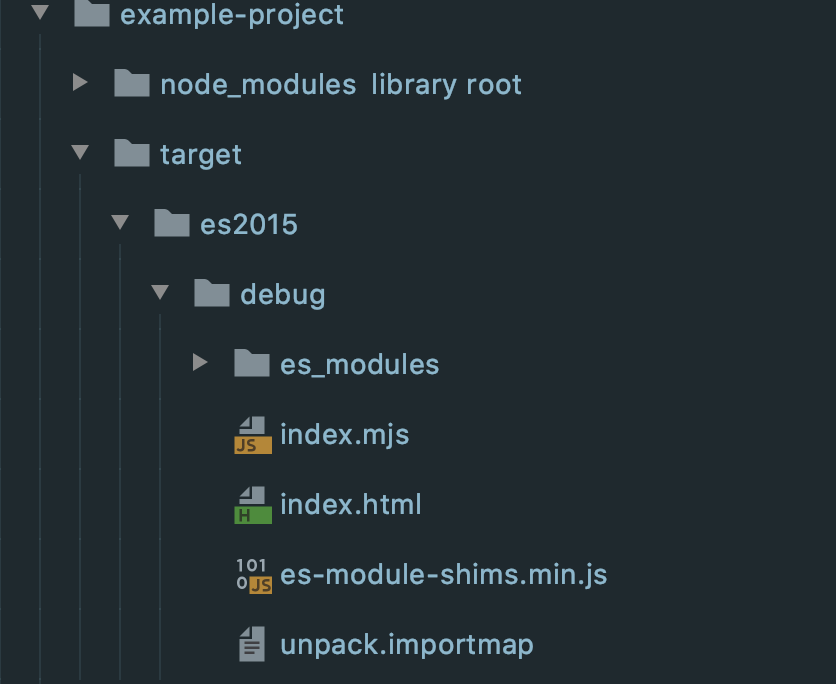

<!-- PROJECT LOGO -->
<!--suppress HtmlDeprecatedAttribute, CheckImageSize -->
<p align="center">
  <a href="https://github.com/adam-cyclones/didi">
    
  </a>

  <h3 align="center">didi</h3>

  <p align="center">
    A transpiler for JavaScript and Typescript, transforming CommonJS modules into distinct ES Modules.
  </p>
</p>


## Who uses didi?
Frontend and deno developers will find didi useful.

## Try it out.
**didi is not ready for production** but you can still try it out.
``` sh
npm install -g @didi-js/didi-cli

# or

yarn global add @didi-js/didi-cli
```
Create a project an entry file, some installed node_modules and then require the browser dependency into your entry file using the base specifier. 
``` js
const colorThief = require('colorThief'); // base specifier example, no paths needed
```

run `didi path/to/example-project`

The result should have output a new target directory within this example-project and also a server should have started on `http://localhost:8086`.
You may see some console errors in the browser, this is normal for this stage.

You may also notce that your import looks like this:
``` js
import colorThief from "color-thief"; // still no path? what wizardry is this!
```
didi also enables node.js style resolution with native ES Modules but right now didi genereates an importmap and optional ES Modules polyfil, even browsers that dont support ES Modules will support them in a didi project.


### How it works:
- You can use the CLI to run didi.
- didi ships with an embedded custom TypeScript compiler.
- When successful, TSC converts all found JavaScript and Typescript in CommonJS modules to distinct ES Modules under a single `es_modules` directory.
- A complete starter project for the browser can be generated or for deno just the `es_modules` directory.
- didi strives to generate minimal glue-code, but as of today, browsers that don't support import-maps will need the es_modules_polyfill (default), The positive side effect is that didi enables support for ES Modules in aging browsers, that includes dynamic import calls!
- A dev-server is provided to test your sources during the build, then finally serve a development environment.
- A dev-browser (headless browser) is used to prune all deps that were not actually used during the build step. A cache will be kept afterward, keeping build times down.
- Everything should work from then on. - but if it doesn't, PR's and issues welcome.

### Experimental ahoy
didi is still experimental but functional, PR's welcome!

## Building for development
To contribute to didi first lets get a copy of this repository setup.
``` sh
git clone https://github.com/adam-cyclones/didi.git

cd didi

yarn install
```
didi is split into packages, every didi package has the same package.json scripts and a similar layout.
At the root of this repository you can see a [package.json](https://github.com/adam-cyclones/didi/blob/957ccbba1b4b5c85e1af4ea3d59e0c0950b88a06/package.json#L12) file which run most of the scripts available to each package from a single location.

For now, `didi-cli-client` is the only way to interact with didi, so you should start here.

``` sh
cd packages/didi-cli-client
// installs @didi-js/didi-lib and @didi-js/didi-devserver 
yarn install

// runs ts-node-dev allowing you to make changes in watch mode without building
yarn dev
```

## What to expect
The result should look a little like this:
<div>
    
</div>


| File / Directory       |                                                                                                                     |
|------------------------|---------------------------------------------------------------------------------------------------------------------|
| target                 | didi output directory                                                                                               |
| es2015                 | we target es2015 until new specification land in the future                                                     |
| debug / release        | debug is unoptimized and faster to build, release will optimize output for production                               |
| es_modules             | This is where all your transpiled es_modules can be found, `es_modules/package/{semver}/main.mjs`                               |
| index.mjs              | This will contain your project and imports based on the specified main of targeted projects package.json            |
| index.html             | The starting point of a didi frontend project, didi writes some glue code to allow a didi project to function        |
| es-module-shims.min.js | Until importmaps are supported didi uses this polyfill by default but it can be turned off for bleeding-edge testing |
| didi.importmap         | Used resolve your ES Modules with base specifiers and remain compatible with (ex) CommonJS (node resolution)        |

### Docs
You can find generated documentation [available here](https://htmlpreview.github.io/?https://github.com/adam-cyclones/didi/blob/master/docs/generated/index.html).

## Community

### Want to help build the future of the web?
There is a growing [list or tasks](https://github.com/adam-cyclones/didi/issues) as didi heads for 1.0.0. Team didi:
- [Adam Crockett](https://dev.to/adam_cyclones)
    > "We need your help, let's break away from bundlers, support didi"
- Do you want to join team didi or maybe leave us a star?

### Community action 
We want to build a collaborative open source community for didi; here are the actions the community decided so far.
- [Vote: choose the name for didi, (formally unpack)](https://dev.to/adam_cyclones/name-this-software-opinion-needed-40m8)
- [Vote: choose the logo for didi](https://dev.to/adam_cyclones/didi-help-me-choose-a-logo-3mo4)
- [Chat with Deno - Can we be dinosaurs too?](https://github.com/denoland/deno/issues/6625)
- [AWS features didi in Open Source News!](https://www.linkedin.com/feed/update/urn:li:activity:6688362989487239169/)

#### Meta
- Logo by Adam Crockett
- दीदी - didi means sister, we are sister a too deno in the sense that we share similar goals, remove CommonJs packages and (for us, CommonJs bundles) from the equation and make packages widely available in a "Webby" way that conforms to EcmaScript standards.
